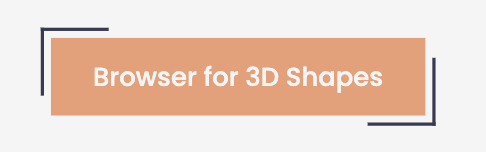
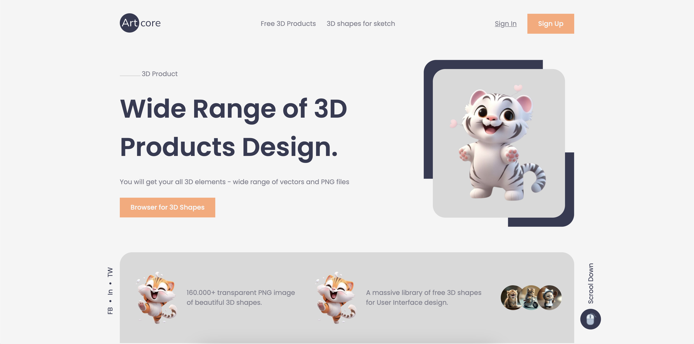

# #Made by :

## [Soeuk Sophanit from BTB Group 2](#made-by)

## Practice CSS Flexbox

## File Guide :

- assets folder for storing
  - logo
  - image
  - svg icon
- css for storing css file
  - global css for reusable style and reset default style.
  - other css are for normal component like :
    - button
    - navbar

# #note that if you want to adding style to button

- just add class `btn-style` to the class that have `btn`

```html
<button class="btn">Button</button>

<!-- so add btn style  -->

<button class="btn btn-style">Button</button>
```

# [Button Style](#button-style)



# [Screenshot](#screenshot)


